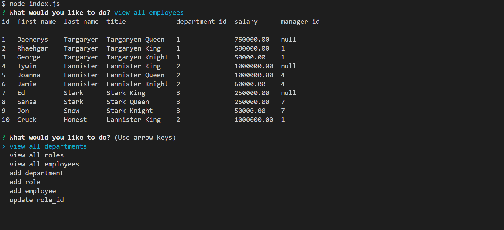

# my-employee-data
Application to track employee information

# Purpose
This application servers to manage the legistics of a company that has an employee model.
It helps keep track of details such as employee role, department and salary.

# Built With
*JavaScript *Node.js *Inquirer *Console.table

# Instructions
- To start app run comand in terminal:  node server.js

# Application

